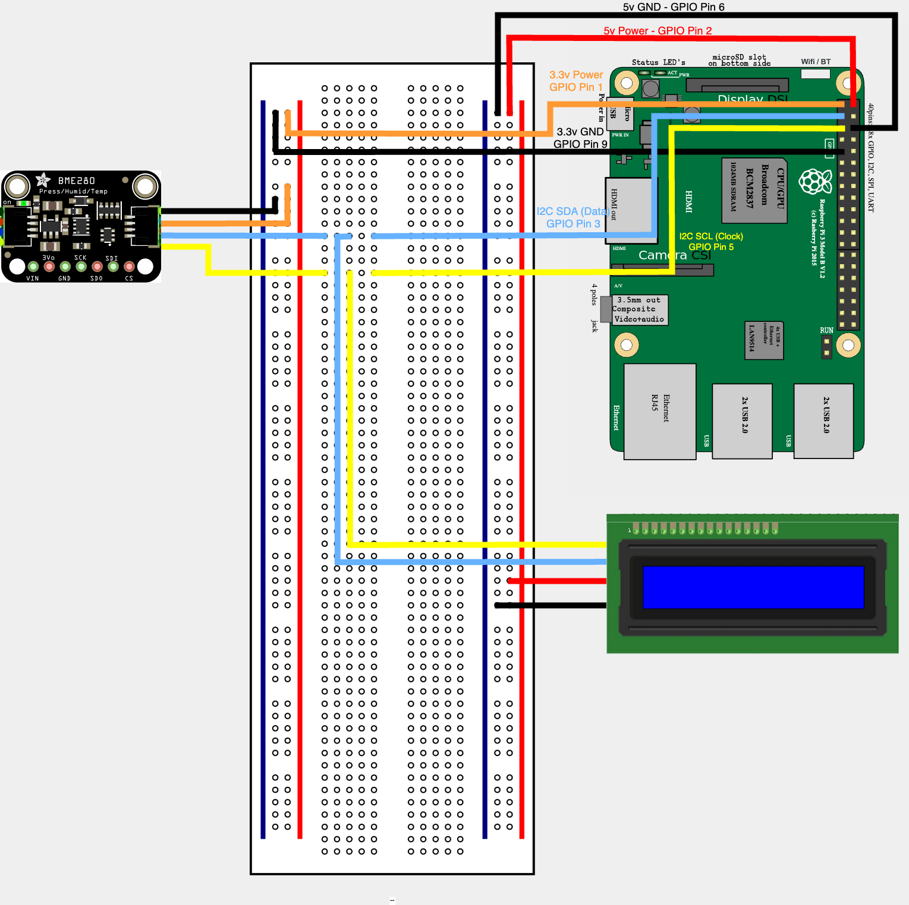

# Raspberry Pi Environmental Sensor Project

This repository contains the code and instructions to deploy an environmental sensor, LCD screen and a Flask-based web server on a Raspberry Pi.

If you would like to see a video of how to deploy this, here is a link to the video on YouTube.

[](https://www.youtube.com/watch?v=jQM6l9f5Nhk)

## Required Hardware

The hardware required for this project is:

- 1 x Raspberry Pi 3 B+ 1GB. You can use either a Pi 4 or 5 instead
- 1 x 128GB SanDisk MicroSD Card. Again, you can use any, but I would recommend a card of at least 64GB or higher
- 1 x Power Adapter
- 1 x Adafruit BME280 Sensor which collects temperature, humidity and pressure
- 1 x LCD Screen. Both of the following will be used, one at a time:
  - 1 x 16x2 LCD Screen with a PCF8574 expander board
  - 1 x 20x4 LCD Screen with a PCF8574 expander board
- Wires – 10 x Male to female jumper / Dupont wires
  - 2 x red (for 5v power)
  - 1 x orange (for 3v power)
  - 2 x black (for ground)
  - 2 x yellow (for i2c SDA)
  - 2 x blue (for i2c SCL)
  - 1 x STEMMA QT / Qwiic JST SH 4-pin to 4-pin male jumper / Dupont wires
- 1 x Breadboard

## Required Software

- The Raspberry Pi Imager tool
- Raspberry Pi OS Lite (on the MicroSD card). This is a version of Raspberry Pi OS that doesn’t have a desktop environment as I needed to free up memory
- A terminal emulator
- Python 3.11
- Microsoft Visual Studio Code (optional)

## Instructions

To begin with, download the repository to a Raspberry Pi and make a note of where it was saved to.

### Connecting the Sensor and LCD Screen

The below diagram shows where the sensor and LCD screen need to be connected on the Raspberry Pi. Double check the GPIO connectors for your Pi as they may be different with newer boards.



### Deploying the Environmental Sensor Code

Connect to the Raspberry Pi using SSH and download the repository to it and make a note of where it was saved to. You may need to install `git` on the Pi for this to work.

``` shell
git clone https://github.com/York13Pud/python-environmental-sensor.git
```

Once the download is complete, `cd` into the directory.

Next, create a new Python virtual environment:

``` shell
python3 -m venv venv
```

Next, activate the virtual environment:

``` shell
source ./venv/bin/activate
```

Next, install the required packages. If pip is not installed, install it using `sudo apt install python3-pip` (it might be python-pip instead if that fails):

``` shell
pip install -r requirements.txt
```

Perform a test run of the code by running:

``` shell
python3 main.py
```

If there are no errors, and it just goes to another command prompt, the code ran successfully. The database.db file should also be present in the folder.

If you would like to show output to the terminal and / or the LCD screen, open the `.env` stored in the `modules/env/` folder and modify the following lines to `true` for either or both:

``` shell
OUTPUT_TO_CONSOLE="false"
LCD_SCREEN_CONNECTED="false"
```

Finally, create a cron job so that the program runs at a set schedule:

``` shell
crontab -e
```

Once open, add the below line to file. It will set the program to run every five minutes. You can adjust that as you see fit:

``` shell
*/5 * * * *  cd /change/this/to/the/path/where/the/program/is/stored/ && venv/bin/python3 main.py
```

Change the path to location where you downloaded the program to. You do not need to change anything after `&&`.

Press ctrl+x to exit. Save the file when prompted. The program will run at the next scheduled time.

That completes the setup of the environmental sensor collector.

### Deploying the Web Server Code

Before you can use the web server, ensure that the `database.db` file is created and has data in the readings table. If not, the web server will produce errors.

To deploy the web server, run:

``` shell
cd webserver
```

Next, create a new Python virtual environment:

``` shell
python3 -m venv venv
```

Next, deactivate any other virtual environments and activate the virtual environment:

``` shell
deactivate
source ./venv/bin/activate
```

Next, install the required packages:

``` shell
pip install -r requirements.txt
```

Finally, you can run the server in debug mode. Running it in production will require a proxy such as NGinx, which is out of scope of this project. To run the web server, run:

``` shell
flask --app main run --host=0.0.0.0
```

The web server should now be running and can be accessed from the IP address shown.
